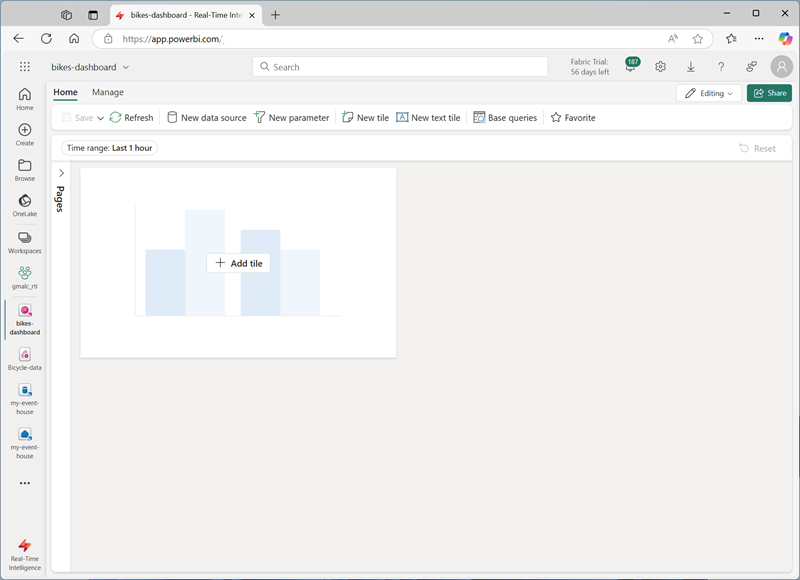
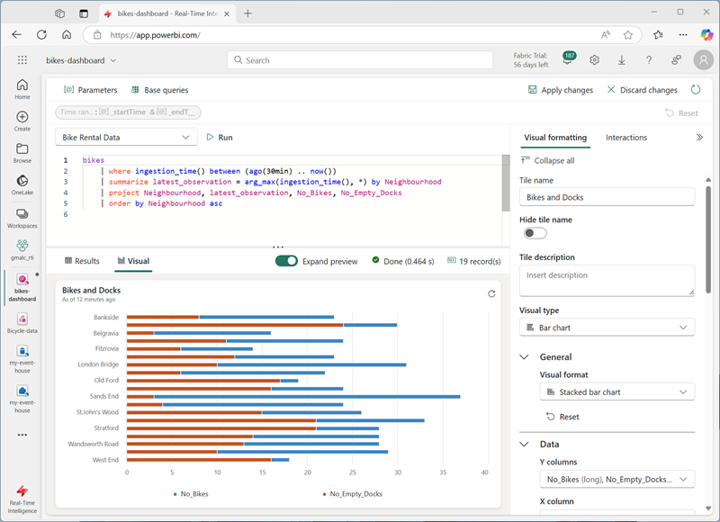
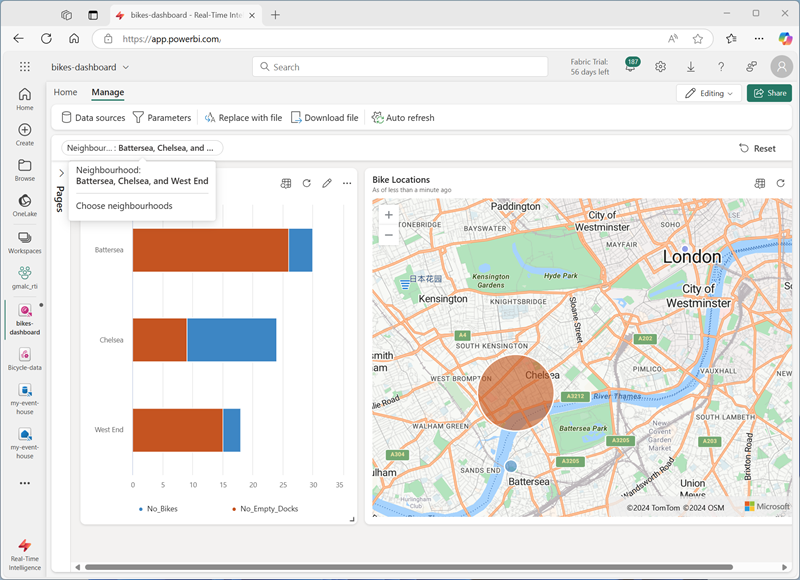
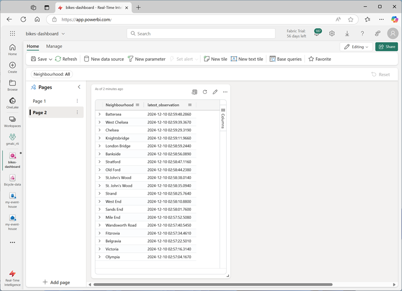

---
lab:
    title: 'Get started with Real-time Dashboards in Microsoft Fabric'
    module: 'Get started with Real-Time Dashboards in Microsoft Fabric'
---

# Get started with Real-Time Dashboards in Microsoft Fabric

Real-time dashboards in Microsoft Fabric enable you to visualize and explore streaming data using the Kusto Query Language (KQL).  In this exercise, you'll explore how to create and use a real-time dashboard based on a real-time data source.

This lab takes approximately **25** minutes to complete.

> **Note**: You need a [Microsoft Fabric tenant](https://learn.microsoft.com/fabric/get-started/fabric-trial) to complete this exercise.

## Create a workspace

Before working with data in Fabric, you need to create a workspace with the Fabric capacity enabled.

1. Navigate to the [Microsoft Fabric home page](https://app.fabric.microsoft.com/home?experience=fabric) at `https://app.fabric.microsoft.com/home?experience=fabric` in a browser and sign in with your Fabric credentials.
1. In the menu bar on the left, select **Workspaces** (the icon looks similar to &#128455;).
1. Create a new workspace with a name of your choice, selecting a licensing mode that includes Fabric capacity (*Trial*, *Premium*, or *Fabric*).
1. When your new workspace opens, it should be empty.

    

## Create an eventhouse

Now that you have a workspace, you can start creating the Fabric items you'll need for your real-time intelligence solution. we'll start by creating an eventhouse.

1. On the menu bar on the left, select **Create**. In the *New* page, under the *Real-Time Inteligence* section, select **Eventhouse**. Give it a unique name of your choice.

    >**Note**: If the **Create** option is not pinned to the sidebar, you need to select the ellipsis (**...**) option first.

1. Close any tips or prompts that are displayed until you see your new empty eventhouse.

    

1. In the pane on the left, note that your eventhouse contains a KQL database with the same name as the eventhouse.
1. Select the KQL database to view it.

## Create an eventstream

Currently there are no tables in the database. We'll use an eventstream to load data from a real-time source into a table.

1. In the main page of your KQL database, select **Get data**.
2. For the data source, select **Eventstream** > **New eventstream**. Name the eventstream `Bicycle-data`.

    

    The creation of your new event stream in the workspace will be completed in just a few moments. Once established, you will be automatically redirected to select a data source for your eventstream.

1. Select **Use sample data**.
1. Name the source name `Bicycles`, and select the **Bicycles** sample data.

    Your stream will be mapped and you will be automatically displayed on the **eventstream canvas**.

   

1. In the **Add destination** drop-down list, select **Eventhouse**.
1. In the **Eventhouse** pane, configure the following setup options.
   - **Data ingestion mode:**: Event processing before ingestion
   - **Destination name:** `bikes-table`
   - **Workspace:** *Select the workspace you created at the beginning of this exercise*
   - **Eventhouse**: *Select your eventhouse*
   - **KQL database:** *Select your KQL database*
   - **Destination table:** Create a new table named `bikes`
   - **Input data format:** JSON

   

1. In the **Eventhouse** pane, select **Save**. 
1. Connect the **Bicycles-data** node's output to the **bikes-table** node, then select **Publish**.
1. Wait a minute or so for the data destination to become active. Then select the **bikes-table** node in the design canvas and view the **Data preview** pane underneath to see the latest data that has been ingested:

   

1. Wait a few minutes and then use the **Refresh** button to refresh the **Data preview** pane. The stream is running perpetually, so new data may have been added to the table.

## Create a real-time dashboard

Now that you have a stream of real-time data being loaded into a table in the eventhouse, you can visualize it with a real-time dashboard.

1. In the menu bar on the left, select the **Home** hub. Then on the home page, create a new **Real-Time Dashboard** named `bikes-dashboard`.

    A new empty dashboard is created.


    

1. In the toolbar, select **New data source** and add a new **One lake data hub** data source. Then select your eventhouse and create a new data source with the following settings:
    - **Display name**: `Bike Rental Data`
    - **Database**: *The default database in your eventhouse*.
    - **Passthrough identity**: *Selected*

1. Close the **Data sources** pane, and then on the dashboard design canvas, select **Add tile**.
1. In the query editor, ensure that the **Bike Rental Data** source is selected and enter the following KQL code:

    ```kql
    bikes
        | where ingestion_time() between (ago(30min) .. now())
        | summarize latest_observation = arg_max(ingestion_time(), *) by Neighbourhood
        | project Neighbourhood, latest_observation, No_Bikes, No_Empty_Docks
        | order by Neighbourhood asc
    ```

1. Run the query, which shows the number of bikes and empty bike docks observed in each neighbourhood in the last 30 minutes.
1. Apply the changes to see the data shown in a table in the tile on the dashboard.

   

1. On the tile, select the **Edit** icon (which looks like a pencil). Then in the **Visual Formatting** pane, set the following properties:
    - **Tile name**: Bikes and Docks
    - **Visual type**: Bar chart
    - **Visual format**: Stacked bar chart
    - **Y columns**: No_Bikes, No-Empty_Docks
    - **X column**: Neighbourhood
    - **Series columns**: infer
    - **Legend location**: Bottom

    Your edited time should look like this:

   

1. Apply the changes and then resize the tile to take up the full height of the left side of the dashboard.

1. In the toolbar, select **New tile**
1. In the query editor, ensure that the **Bike Rental Data** source is selected and enter the following KQL code:

    ```kql
    bikes
        | where ingestion_time() between (ago(30min) .. now())
        | summarize latest_observation = arg_max(ingestion_time(), *) by Neighbourhood
        | project Neighbourhood, latest_observation, Latitude, Longitude, No_Bikes
        | order by Neighbourhood asc
    ```

1. Run the query, which shows the location and number of bikes observed in each neighbourhood in the last 30 minutes.
1. Apply the changes to see the data shown in a table in the tile on the dashboard.
1. On the tile, select the **Edit** icon (which looks like a pencil). Then in the **Visual Formatting** pane, set the following properties:
    - **Tile name**: Bike Locations
    - **Visual type**: Map
    - **Define location by**: Latitude and longitude
    - **Latitude column**: Latitude
    - **Longitude column**: Longitude
    - **Label column**: Neighbourhood
    - **Size**: Show
    - **Size column**: No_Bikes

1. Apply the changes, and then resize the map tile to fill the right side of the available space on the dashboard:

   

## Create a base query

Your dashboard contains two visuals that are based on similar queries. To avoid duplication and make your dashboard more maintainable, you can consolidate the common data into a single *base query*.

1. On the dashboard toolbar, select **Base queries**. Then select **+Add**.
1. In the base query editor, set the **Variable name** to `base_bike_data` and ensure that the **Bike Rental Data** source is selected. Then enter the following query:

    ```kql
    bikes
        | where ingestion_time() between (ago(30min) .. now())
        | summarize latest_observation = arg_max(ingestion_time(), *) by Neighbourhood
    ```
1. Run the query and verify that it returns all of the columns needed for both visuals in the dashboard (and some others).

   

1. Select **Done** and then close the **Base queries** pane.
1. Edit the **Bikes and Docks** bar chart visual, and change the query to the following code:

    ```kql
    base_bike_data
    | project Neighbourhood, latest_observation, No_Bikes, No_Empty_Docks
    | order by Neighbourhood asc
    ```

1. Apply the changes and verify that the bar chart still displays data for all neighborhoods.

1. Edit the **Bike Locations** map visual, and change the query to the following code:

    ```kql
    base_bike_data
    | project Neighbourhood, latest_observation, No_Bikes, Latitude, Longitude
    | order by Neighbourhood asc
    ```

1. Apply the changes and verify that the map still displays data for all neighborhoods.

## Add a parameter

Your dashboard currently shows the latest bike, dock, and location data for all neighborhoods. Now lets add a parameter so you can select a specific neighborhood.

1. On the dashboard toolbar, on the **Manage** tab, select **Parameters**.
1. Note any existing parameters that have been automatically created (for example a *Time range* parameter). Then **Delete** them.
1. Select **+ Add**.
1. Add a parameter with the following settings:
    - **Label**: `Neighbourhood`
    - **Parameter type**: Multiple selection
    - **Description**: `Choose neighbourhoods`
    - **Variable name**: `selected_neighbourhoods`
    - **Data type**: string
    - **Show on pages**: Select all
    - **Source**: Query
    - **Data source**: Bike Rental Data
    - **Edit query**:

        ```kql
        bikes
        | distinct Neighbourhood
        | order by Neighbourhood asc
        ```

    - **Value column**: Neighbourhood
    - **Label column**: Match value selection
    - **Add "Select all" value**: *Selected*
    - **"Select all" sends empty string**: *Selected*
    - **Auto-reset to default value**: Selected
    - **Default value**: Select all

1. Select **Done** to create the parameter.

    Now that you've added a parameter, you need to modify the base query to filter the data based on the chosen neighborhoods.

1. In the toolbar, select **Base queries**. Then select the **base_bike_data** query and edit it to add an **and** condition to the **where** clause to filter based on the selected parameter values, as shown in the following code:

    ```kql
    bikes
        | where ingestion_time() between (ago(30min) .. now())
          and (isempty(['selected_neighbourhoods']) or Neighbourhood  in (['selected_neighbourhoods']))
        | summarize latest_observation = arg_max(ingestion_time(), *) by Neighbourhood
    ```

1. Select **Done** to save the base query.

1. In the dashboard, use the **Neighbourhood** parameter to filter the data based on the neighborhoods you select.

   

1. Select **Reset** to remove the selected parameter filters.

## Add a page

Your dashboard currently consists of a single page. You can add more pages to provide more data.

1. On the left side of the dashboard, expand the **Pages** pane; and select **+ Add page**.
1. Name the new page **Page 2**. Then select it.
1. On the new page, select **+ Add tile**
1. In the query editor for the new tile, enter the following query:

    ```kql
    base_bike_data
    | project Neighbourhood, latest_observation
    | order by latest_observation desc
    ```

1. Apply the changes. Then resize the tile to fill the height of the dashboard.

   

## Configure auto refresh

Users can manually refresh the dashboard, but it may be useful to have it automatically refresh the data at a set interval.

1. On the dashboard toolbar, on the **Manage** tabe, select **Auto refresh**.
1. In the **Auto refresh** pane, configure the following settings:
    - **Enabled**: *Selected*
    - **Minimum time interval**: Allow all refresh intervals
    - **Default refresh rate**: 30 minutes
1. Apply the auto refresh settings.

## Save and share the dashboard

Now you have a useful dashboard, you can save it and share it with other users.

1. On the dashboard toolbar, select **Save**.
1. When the dashboard is saved, select **Share**.
1. On the **Share** dialog box, select **Copy link** and copy the link to the dashboard to the clipboard.
1. Open a new browser tab and paste the copied link to navigate to the shared dashboard. Sign in again with your Fabric credentials if prompted.
1. Explore the dashboard, using it to see the latest information about bikes and empty bike docks across the city.

## Clean up resources

When you've finished exploring your dashboard, you can delete the workspace you created for this exercise.

1. In the bar on the left, select the **icon** for your workspace.
2. In the the toolbar, select **Workspace settings**.
3. In the **General** section, select **Remove this workspace**.
